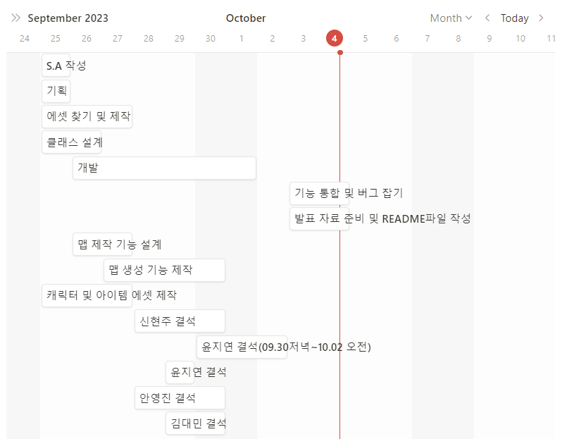

# ReadMe

[https://capsule-render.vercel.app/api?type=waving&color=gradient&customColorList=19&height=300&section=header&text=I%20HATE%20MONDAY&fontSize=90&fontColor=fff76b](https://capsule-render.vercel.app/api?type=waving&color=gradient&customColorList=19&height=300&section=header&text=I%20HATE%20MONDAY&fontSize=90&fontColor=fff76b)

## 목차

| notion://www.notion.so/ReadMe-60dc474f1d0f4d9e998e6328300d0d10#%EA%B2%8C%EC%9E%84-%EC%86%8C%EA%B0%9C |
| --- |
| notion://www.notion.so/ReadMe-60dc474f1d0f4d9e998e6328300d0d10#%EA%B8%B0%EB%8A%A5%EB%B3%84-%EC%BD%94%EB%93%9C |
| notion://www.notion.so/ReadMe-60dc474f1d0f4d9e998e6328300d0d10#%EB%A7%8C%EB%93%A0-%EC%82%AC%EB%9E%8C%EB%93%A4 |

---

## [🎮 YouTube](notion://www.notion.so/ReadMe-60dc474f1d0f4d9e998e6328300d0d10)

[스파르타 내일배움캠프 B08조 시연영상](https://youtu.be/3XgtQlZwzNI)

## [🐌 Team Notion](notion://www.notion.so/%5B%3Chttps://teamsparta.notion.site/08-814d16993a734e0b97c716e95ebf4c0e%3E%5D(%3Chttps://www.notion.so/08-391aea063ff54087832f702c116f9ab5%3E))

## 게임 소개

[⭐ 목차로 돌아가기 ⭐](notion://www.notion.so/ReadMe-60dc474f1d0f4d9e998e6328300d0d10#%EB%AA%A9%EC%B0%A8)

- **게임 명: `월요일이 좋겠냐?`**
- **영어 명: `I hate monday!`**
- **설명:** [내일 배움 캠프 8기 Unity] Chapter 3-2 게임개발 숙련 B08조 팀 프로젝트
- **장르**: 2D 로그라이크 게임
- **게임 개요:**
    - 게살 버거를 주문하는 시민들과 친구들로 부터 징징이의 휴식을 지켜내세요!
    집게사장, 스폰지밥, 뚱이는 징징이를 특히나 더 악독하게 괴롭히니 주의하세요!
- **조작법:**    
    | 키 | 수행 기능 |
    | --- | --- |
    | F | 무기 버리기 |
    | E | 줍기 |
    | Shift | 액티브 아이템 전환 |
    | Space | 액티브 아이템 사용 |
    | left Ctrl | 무기 전환 |
    | W,A,S,D | 상,하,좌,우 이동 |
    | 마우스 현재 위치 | 조준점 설정 |
    | 마우스 key Down | 총알이 없을 시 무기 재장전 |
    | 마우스 key Press | 무기 별 상이 |
    | 마우스 key Up | 무기 별 상이 |
- **무기별 사용 설명**
    |  | 마우스 key down | 마우스 key press | 마우스 key up |
    | --- | --- | --- | --- |
    | 매그넘건
    (SemiAutGun) | 발사 (manualCoolTime) | 발사 (autoCoolTime) | - |
    | 콜트건
    (BurstGun) | 2발 발사 | - | - |
    | 라이플건
    (AutoGun) | 발사 | - | - |
    | 문스크래퍼건
    (LaserGun) | 레이저 생성 | - | 레이저 삭제 |
    | 레일건
    (CharzingGun) | 차징시작 | - | 차징 시간에 따른 총알 발사 |
    | 샷건
    (SemiAutoGun) | 발사 ,한번에 6발 (manualCoolTime) | 발사 , 한번에 6발 (autoCoolTime) | - |
    | 검
    (CharzingGun) | 차징시작 | - | 차징 시간에 따라 총알발사 or 일반공격 |
- **사용한 에셋**
    - **🗺️ 맵**
    - **😶 캐릭터**
    - 📦 **상자**
    - 🪄 **아이템**
        
        [Free Game Items](https://assetstore.unity.com/packages/2d/environments/free-game-items-131764)
        
    - 🏔️ **아티팩트**
    - 🔫 **총**
    - 📢 **사운드**
        - BGM
            
            [01-The Rake Hornpipe.mp3](ReadMeAsset/01-The_Rake_Hornpipe.mp3)
            
            [06-Pell-Mell.mp3](ReadMeAsset/06-Pell-Mell.mp3)
            
            [12-Closing Theme Song.mp3](ReadMeAsset/12-Closing_Theme_Song.mp3)
            
        - Effect
            
            [스폰지밥_화날려고해그만해.mp3](ReadMeAsset/%25EC%258A%25A4%25ED%258F%25B0%25EC%25A7%2580%25EB%25B0%25A5_%25ED%2599%2594%25EB%2582%25A0%25EB%25A0%25A4%25EA%25B3%25A0%25ED%2595%25B4%25EA%25B7%25B8%25EB%25A7%258C%25ED%2595%25B4.mp3)
            
            [집게사장_빨리일시작해.mp3](ReadMeAsset/%25EC%25A7%2591%25EA%25B2%258C%25EC%2582%25AC%25EC%259E%25A5_%25EB%25B9%25A8%25EB%25A6%25AC%25EC%259D%25BC%25EC%258B%259C%25EC%259E%2591%25ED%2595%25B4.mp3)
            
            [집게사장_심장마비.mp3](ReadMeAsset/%25EC%25A7%2591%25EA%25B2%258C%25EC%2582%25AC%25EC%259E%25A5_%25EC%258B%25AC%25EC%259E%25A5%25EB%25A7%2588%25EB%25B9%2584.mp3)
            
            [집게사장_징징아.mp3](ReadMeAsset/%25EC%25A7%2591%25EA%25B2%258C%25EC%2582%25AC%25EC%259E%25A5_%25EC%25A7%2595%25EC%25A7%2595%25EC%2595%2584.mp3)
            
            [징징이 _모두안녕찌질이들.mp3](ReadMeAsset/%25EC%25A7%2595%25EC%25A7%2595%25EC%259D%25B4__%25EB%25AA%25A8%25EB%2591%2590%25EC%2595%2588%25EB%2585%2595%25EC%25B0%258C%25EC%25A7%2588%25EC%259D%25B4%25EB%2593%25A4.mp3)
            
            [징징이_아옥.mp3](ReadMeAsset/%25EC%25A7%2595%25EC%25A7%2595%25EC%259D%25B4_%25EC%2595%2584%25EC%2598%25A5.mp3)
            
            [Plankton-Damage.mp3](ReadMeAsset/Plankton-Damage.mp3)
            
            [Spongebob-Dead.mp3](ReadMeAsset/Spongebob-Dead.mp3)
            
            [뚱이_비명.mp3](ReadMeAsset/%25EB%259A%25B1%25EC%259D%25B4_%25EB%25B9%2584%25EB%25AA%2585.mp3)
            
            [뚱이_어우심하다.mp3](ReadMeAsset/%25EB%259A%25B1%25EC%259D%25B4_%25EC%2596%25B4%25EC%259A%25B0%25EC%258B%25AC%25ED%2595%2598%25EB%258B%25A4.mp3)
            
            [뚱이_웃음.mp3](ReadMeAsset/%25EB%259A%25B1%25EC%259D%25B4_%25EC%259B%2583%25EC%259D%258C.mp3)
            
            [스폰지밥_월요일좋아.mp3](ReadMeAsset/%25EC%258A%25A4%25ED%258F%25B0%25EC%25A7%2580%25EB%25B0%25A5_%25EC%259B%2594%25EC%259A%2594%25EC%259D%25BC%25EC%25A2%258B%25EC%2595%2584.mp3)
            

### 개발 기간 `2023.09.25 ~ 2023.10.04`

- **`2023.09.25 (월)`**
    - 📝 발제 확인 및 S.A 작성
    - 📝 필수 및 선택 요구 사항 우선 순위 설정
    - 👥 기획 및 역할 분담
    - [🛠️ 클래스 설계](https://www.figma.com/file/YjcQ8EoHTro3h2ZY3Od9jB/ClassDiagram?type=whiteboard&node-id=0%3A1&t=gnFKT6QjY3EVT6S1-1)
- **`2023.09.26 (화) ~ 2023.10.03 (수)`**
    - 🧑‍💻 구현
    - [📝 기능 명세서 작성](https://www.notion.so/e7f9880d7113421c9d8312f6d389c29d?pvs=21)
- **`2023.10.03 (수) ~ 2023.10.04 (목)`**
    - 🔗 각자 개발한 기능 통합
    - 🐞 버그 찾고 해결
- **`2023.10.04 (목)`**
    - 📝 ReadMe파일 작성
    - 📝 발표 자료 제작

---

## 기능별 코드

[⭐ 목차로 돌아가기 ⭐](notion://www.notion.so/ReadMe-60dc474f1d0f4d9e998e6328300d0d10#%EB%AA%A9%EC%B0%A8)

- **Start Scene**

| Class | 기능 |
| --- | --- |
| StartScene | https://github.com/jungbosong/IHateMonday/blob/512019e53cc7c4686fcb69d974e9a7491fed2c35/Assets/Scripts/Scene/StartScene.cs#L16-L19 |

- **Dungeon Scene**

| Class | 기능 |
| --- | --- |
| PlayerStats | notion://www.notion.so/ReadMe-60dc474f1d0f4d9e998e6328300d0d10 |
| PlayerStatsHandler | notion://www.notion.so/ReadMe-60dc474f1d0f4d9e998e6328300d0d10 |
| PlayerInputCotroller | notion://www.notion.so/ReadMe-60dc474f1d0f4d9e998e6328300d0d10 |
| HealthSystem | notion://www.notion.so/ReadMe-60dc474f1d0f4d9e998e6328300d0d10 |
| CharacterMovement | notion://www.notion.so/ReadMe-60dc474f1d0f4d9e998e6328300d0d10 |
| CharacterAimRotation | notion://www.notion.so/ReadMe-60dc474f1d0f4d9e998e6328300d0d10 |
| UI_DungeonScene | https://github.com/jungbosong/IHateMonday/blob/e031886f6ed9506de7a9d348f8f66d12d1fa795d/Assets/Scripts/UI/Scene/UI_DungeonScene.cs#L79-L129 |
| InventoryUI | https://github.com/jungbosong/IHateMonday/blob/e031886f6ed9506de7a9d348f8f66d12d1fa795d/Assets/Scripts/Item/InventoryUI.cs#L22-L48 |
| CharacterStats | https://github.com/jungbosong/IHateMonday/blob/e031886f6ed9506de7a9d348f8f66d12d1fa795d/Assets/Scripts/Character/Entities/CharacterStats.cs#L9-L11 |
| ContactEnemyController | https://github.com/jungbosong/IHateMonday/blob/e031886f6ed9506de7a9d348f8f66d12d1fa795d/Assets/Scripts/Character/Controllers/ContactEnemyController.cs#L37-L42 |
|  | https://github.com/jungbosong/IHateMonday/blob/e031886f6ed9506de7a9d348f8f66d12d1fa795d/Assets/Scripts/Character/Controllers/ContactEnemyController.cs#L49-L51 |
| ShootEnemyController | https://github.com/jungbosong/IHateMonday/blob/e031886f6ed9506de7a9d348f8f66d12d1fa795d/Assets/Scripts/Character/Controllers/ShootEnemyController.cs#L22-L53 |
|  | https://github.com/jungbosong/IHateMonday/blob/480f81e6010e97388fd4bb0ee3286c0415e87343/Assets/Scripts/Character/Controllers/ShootEnemyController.cs#L34-L40 |
| DisappearOnDeath | https://github.com/jungbosong/IHateMonday/blob/512019e53cc7c4686fcb69d974e9a7491fed2c35/Assets/Scripts/Character/Entities/DisappearOnDeath.cs#L16-L34 |
|  | notion://www.notion.so/ReadMe-60dc474f1d0f4d9e998e6328300d0d10 |
|  | notion://www.notion.so/ReadMe-60dc474f1d0f4d9e998e6328300d0d10 |
|  | notion://www.notion.so/ReadMe-60dc474f1d0f4d9e998e6328300d0d10 |
|  | notion://www.notion.so/ReadMe-60dc474f1d0f4d9e998e6328300d0d10 |
| Wave | https://github.com/jungbosong/IHateMonday/blob/512019e53cc7c4686fcb69d974e9a7491fed2c35/Assets/Scripts/Waves/Wave.cs#L58-L104 |
|  | https://github.com/jungbosong/IHateMonday/blob/512019e53cc7c4686fcb69d974e9a7491fed2c35/Assets/Scripts/Waves/Wave.cs#L113-L121 |
| BossStage | https://github.com/jungbosong/IHateMonday/blob/512019e53cc7c4686fcb69d974e9a7491fed2c35/Assets/Scripts/Waves/BossStage.cs#L59-L65 |
|  | notion://www.notion.so/ReadMe-60dc474f1d0f4d9e998e6328300d0d10 |
| Item | https://github.com/jungbosong/IHateMonday/blob/512019e53cc7c4686fcb69d974e9a7491fed2c35/Assets/Scripts/Item/Item.cs#L12-L62 |
| UseItem
Inventory | https://github.com/jungbosong/IHateMonday/blob/1785e7f7b3078f67823f1d224cca953f08512029/Assets/Scripts/Item/UseItem.cs#L5-L100 |
| Inventory | https://github.com/jungbosong/IHateMonday/blob/1785e7f7b3078f67823f1d224cca953f08512029/Assets/Scripts/Item/Inventory.cs#L169-L176 |
| Altar | https://github.com/jungbosong/IHateMonday/blob/512019e53cc7c4686fcb69d974e9a7491fed2c35/Assets/Scripts/Item/Altar.cs#L5-L101 |
|  | notion://www.notion.so/ReadMe-60dc474f1d0f4d9e998e6328300d0d10 |
|  | notion://www.notion.so/ReadMe-60dc474f1d0f4d9e998e6328300d0d10 |
| SoundManager
SoundSO
CharacterPlaySound | notion://www.notion.so/ReadMe-60dc474f1d0f4d9e998e6328300d0d10 |
| Room | https://github.com/jungbosong/IHateMonday/blob/512019e53cc7c4686fcb69d974e9a7491fed2c35/Assets/Scripts/Map/Room.cs#L19-L38 |
|  | https://github.com/jungbosong/IHateMonday/blob/512019e53cc7c4686fcb69d974e9a7491fed2c35/Assets/Scripts/Map/Room.cs#L47-L59 |

- **DeadEndScene**    
    | Class | 기능 |
    | --- | --- |
    | DeadScene | notion://www.notion.so/ReadMe-60dc474f1d0f4d9e998e6328300d0d10 |

---

## 만든 사람들

[⭐ 목차로 돌아가기 ⭐](notion://www.notion.so/ReadMe-60dc474f1d0f4d9e998e6328300d0d10#%EB%AA%A9%EC%B0%A8)

